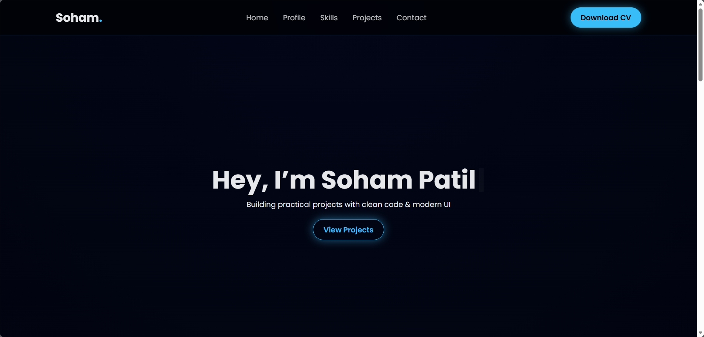

# 🚀 Soham Patil – Personal Portfolio Website

A modern, animated personal portfolio website built to showcase my skills, projects, and professional profile as a **BCA (Computer Applications) student**, **aspiring software developer**, and **future tech entrepreneur**.

🔗 **Live Website:**  
👉 https://soham-patil-tech.github.io/soham.portfolio/

---

## 📌 Overview

This portfolio website serves as my **digital resume and professional identity**.  
It is designed to create a strong first impression through a clean layout, smooth animations, and a focused presentation of my skills, projects, and goals.

The site is fully responsive, performance-optimized, and deployed using **GitHub Pages**.

---
## 📸 Preview

### Desktop View


### Mobile View


## 🎯 Objectives

- Present skills and projects in a clean, structured way  
- Demonstrate front-end development fundamentals  
- Showcase UI/UX design sense and animation handling  
- Provide easy access to resume and professional profiles  

---

## ✨ Key Features

- 🎨 Modern glassmorphism UI
- ⌨️ Typing animation for name
- 🎯 Scroll-based reveal animations
- 🌊 Animated background effects
- 📄 Resume view & download option
- 📱 Fully responsive (mobile-friendly)
- 🔗 Direct links to GitHub, LinkedIn, and Instagram
- 💬 WhatsApp direct message button for instant contact
- 📧 Email contact button for professional communication


---

## 🛠️ Tech Stack

| Technology | Purpose |
|----------|--------|
| HTML5 | Semantic structure |
| CSS3 | Styling, animations, layout |
| JavaScript | Interactivity & effects |
| GitHub Pages | Deployment & hosting |

---

## 📂 Project Structure

```text
soham.portfolio/
│── index.html
│── style.css
│── script.js
│── resume/
│   └── Soham_Patil_Resume.pdf
│── README.md
